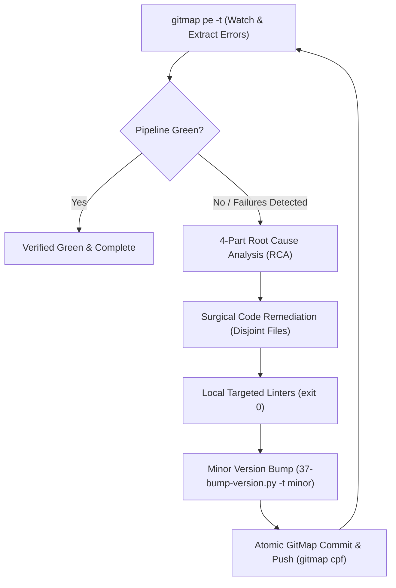

# Autonomous CI/CD Pipeline Healing & Minor Release Loop via GitMap (`ci-cd-fix-gitmap-release`)

This skill autonomously monitors, diagnoses, and resolves all CI/CD pipeline failures across the repository using GitMap live telemetry (`gitmap pe -t`), performs grounded 4-part Root Cause Analysis (RCA), applies surgical code fixes without disabling CI or deleting tests, verifies locally with targeted linters, commits with `gitmap cpf "<module> - 
"`, executes a minor version bump using `python 03-ai-scripts/37-bump-version.py -t minor`, tags and pushes, and continuously loops until all CI/CD workflows are completely green.

## Core Operational Workflow

## Continuous Self-Healing Steps

### Step 1: Live Pipeline Telemetry & Failure Extraction
1. Run `gitmap pe -t` to inspect live workflow runs, timings, and error logs.
2. Alternatively run `gitmap pe` to view the latest failure dossier.
3. If all workflows are green (`✔ clean` / pass), exit loop with success.

### Step 2: Grounded 4-Part Root Cause Analysis (RCA)
For every detected failure, document a 4-part RCA under `.ai-memory/cicd-issues/`:
- **Part 1 (Symptom):** Exact workflow, job, step name, and error message.
- **Part 2 (Root Cause):** Underlying code defect, missing argument, drift, or syntax violation.
- **Part 3 (Surgical Fix):** Minimal file-scoped change resolving the cause without modifying CI triggers.
- **Part 4 (Verification):** Local targeted check command proving resolution.

### Step 3: Surgical Code Remediation
1. Spawn worker subagents in disjoint file boundaries to apply fixes.
2. Workers adhere to strict coding guidelines (implicit booleans, Result containers, vertical spacing).
3. Workers NEVER run `git add` or `git commit`.

### Step 4: Local Targeted Verification
1. Run targeted linters on touched files:
   - `python 03-ai-scripts/05-guideline-autofixer.py <path> --check-only`
   - `python linter-scripts/check-prompts-loaded.py --fix`
   - `python linter-scripts/check-relative-paths.py`
2. Never run heavy full build or full test suites (R1).

### Step 5: Minor Version Bump & Release Ceremony
1. Perform minor version bump:
   `python 03-ai-scripts/37-bump-version.py -t minor -s "
"`
2. Verify manifests (`package.json`, `version.json`, `readme.md`, `changelog.md`) are updated.
3. Commit atomically via GitMap:
   `gitmap cpf "<module> - fix CI/CD and release minor version"`
4. Tag release version (`git tag -a vX.Y.Z -m "..."`) and push to origin (`git push origin vX.Y.Z`).

### Step 6: Loop & Verify
1. Immediately re-run `gitmap pe -t` to watch the newly triggered CI/CD run.
2. If failures persist, repeat from Step 1.
3. When green, output completion summary.

## Non-Negotiable Invariants

- **NEVER DISABLE CI/CD:** Strictly forbidden from commenting out or bypassing CI/CD steps.
- **Strict Relative Git Paths:** Strict Relative Git Paths Only: Only add the relative paths, never add the absolute path during your work, and ensure this is respected on the release page and in release notes as well (TOTAL BAN on `file:///` URIs and absolute filesystem paths).
- **Strict Lowercase:** All generated files must use strictly lowercase naming.
