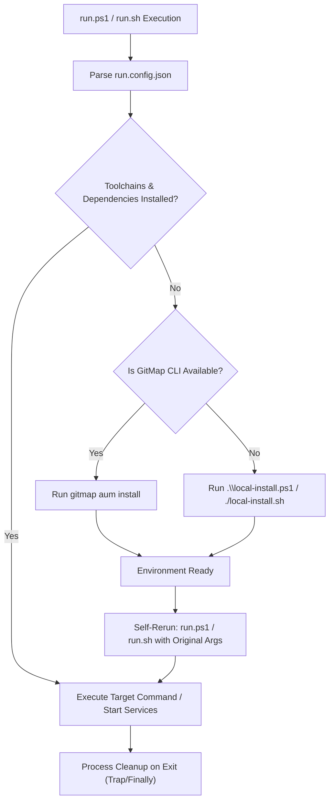

# Create Run & Install Scripts Skill (`create-run-ps1-file`)

This skill autonomously architects, constructs, and verifies cross-platform execution runners (`run.ps1` and `run.sh`) driven by a central `run.config.json` manifest, along with accompanying standalone environment installation scripts (`local-install.ps1` and `local-install.sh`). It implements robust dependency pre-flight checks, intelligent fallback to GitMap (`gitmap aum install`) or `local-install.ps1`/`local-install.sh` with automatic rerun, and clean process cleanup on exit.

## Architecture & Lifecyle

## Implementation Standards

1. **Manifest Driven (`run.config.json`):**
   - Centralize all ports, paths, and commands.
   - Support token replacement (e.g. `{fePort}`, `{bePort}`).
2. **Self-Healing Fallback:**
   - Detect missing dependencies at runtime.
   - Check for GitMap environment manager first (`gitmap aum install`).
   - Fall back to `local-install.ps1` / `local-install.sh`.
   - Re-verify and automatically re-execute `run.ps1`.
3. **CI Mode Support (`-CI` / `--ci`):**
   - Non-interactive execution of build, lint, and test suites.
   - Immediate exit 1 on any failure.
4. **Clean Process Management:**
   - Track spawned PIDs and terminate in `finally` / `trap` blocks.
