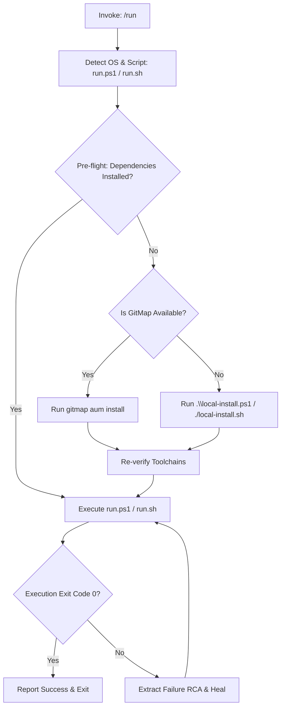

# Run Script Orchestration Skill (`run`)

This skill autonomously executes the project run script (`.\run.ps1` on Windows pwsh, or `./run.sh` on Unix/macOS) with target parameters and complete self-healing dependency recovery. It inspects `run.config.json`, verifies required toolchains, and if dependencies are missing, automatically falls back to environment installation via GitMap (`gitmap aum install`) or `.\local-install.ps1` (`./local-install.sh`), automatically rerunning `run.ps1` once installed.

## Execution Workflow

## Step-by-Step Instructions

1. **Detect Host Environment:**
   - Windows: Execute PowerShell `.\run.ps1 <target>`
   - Linux/macOS: Execute Bash `./run.sh <target>`
2. **Pre-flight Dependency Verification:**
   - If required toolchains are missing:
     - Check `Get-Command gitmap -ErrorAction SilentlyContinue`.
     - If available, execute `gitmap aum install`.
     - Otherwise, execute `.\local-install.ps1` (or `./local-install.sh`).
     - Rerun `.\run.ps1 <target>`.
3. **Modes:**
   - Standard Development: `.\run.ps1`
   - CI Pipeline Mode: `.\run.ps1 -CI`
   - Subsystem Execution: `.\run.ps1 <service>`
4. **Verification:**
   - Confirm exit code 0 and report output.

## Non-Negotiable Invariants

- **Strict Relative Git Paths:** Strict Relative Git Paths Only: Only add the relative paths, never add the absolute path during your work, and ensure this is respected on the release page and in release notes as well (TOTAL BAN on `file:///` URIs and absolute filesystem paths).
- **Zero Disabling CI/CD:** Never disable, bypass, or delete tests or CI workflows.
- **GitMap Primacy:** Use GitMap (`gitmap aum search`, `gitmap find`, `gitmap ps`) for tool discovery.
