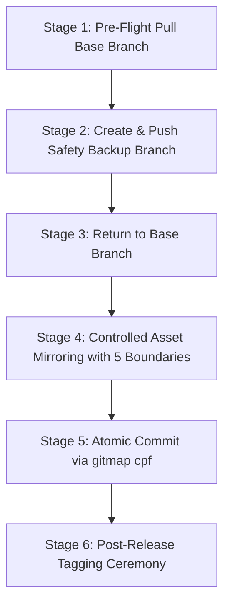

# Multi-Repository Synchronization & Deployment Engine (`sync`)

> **[/goal](slashCommand:goal)** Autonomously synchronize canonical prompts, Antigravity skills, Cursor skills, shared specifications (`02-spec/01-*` through `02-spec/20-*`), and additive AI scripts across all 43 connected repositories using pre-flight safety backups, GitMap atomic commits, SemVer release tagging, and non-negotiable boundary protections.
> **[/learn](slashCommand:learn)** Enforce the 5 Non-Negotiable Boundaries (Spec 21 Exclusion, Bump Script Protection, Additive-Only AI Scripts with Repo Modification Checks, Memory & Plans Protection, Zero Secrets Mandate), pre-flight backup branch creation, SemVer release ceremonies, and parameter-driven inputs without hardcoding machine-specific absolute filesystem paths.

**Version:** 1.0.0
**Updated:** 2026-10-03
**Status:** Active
**AI Confidence:** Production-Ready
**Canonical Prompt:** `01-prompts/24-sync/01-sync.md`
**Automation Engine:** `gitmap sync` (Go native, primary) | `python 03-ai-scripts/38-sync-prompts-skills-scripts.py` (legacy fallback)

---

## 1. Overview & When to Use

The `sync` skill orchestrates end-to-end multi-repository synchronization across the entire 43-repository workspace fleet. It propagates canonical prompts (`01-prompts/`), agent skills (`.agents/skills/`, `.cursor/skills/`), shared specifications (`02-spec/01-*` through `02-spec/20-*`), and automation utilities (`03-ai-scripts/`, `.agents/scripts/`) from the central `coding-guidelines` meta-repository into every connected downstream repository.

### When to Activate This Skill

- **Full Multi-Repo Sync:** When the user issues `sync`, `sync all repos`, `deploy prompts across repos`, or requests synchronizing all connected repositories.
- **Canonical Prompt Updates:** When canonical prompts in `01-prompts/` are authored, updated, or re-indexed.
- **Skill Propagation:** When new Antigravity skills in `.agents/skills/` or Cursor skills in `.cursor/skills/` are created or upgraded.
- **Shared Specification Distribution:** When core specifications in `02-spec/01-*` through `02-spec/20-*` (such as `01-spec-authoring-guide`, `02-coding-guidelines`, `03-error-manage`, `04-database-conventions`, etc.) are updated and must be mirrored downstream.
- **Additive Tooling Rollout:** When new scripts in `03-ai-scripts/` or `.agents/scripts/` need distribution to connected repositories.

---

## 2. Connected Repositories Fleet (43 Repositories)

The synchronization engine operates across 43 registered target repositories located relative to the workspace parent directory:

| # | Repository Name | Relative Workspace Path | Primary Technology / Stack |
| :---: | :--- | :--- | :--- |
| **01** | `ai-empathy-prompt-tuner` | `../02-prompts/ai-empathy-prompt-tuner` | TypeScript / Prompts |
| **02** | `alim-cv` | `../alim-cv` | React / TypeScript |
| **03** | `alim-karim-profile` | `../alim-karim-profile` | React / TypeScript |
| **04** | `alim.karim.profile` | `../aukgit/alim.karim.profile` | Web / Portfolio |
| **05** | `antigravity-manager` | `../antigravity-manager` | Go / CLI / Windows |
| **06** | `cat-my` | `../cat-my` | Full Stack / Automation |
| **07** | `core` | `../03-aukgo/core` | Go / Microservices |
| **08** | `digital-name-card` | `../digital-name-card` | Web / Identity |
| **09** | `flat-slide-show` | `../presentations-repos/flat-slide-show` | Web / Presentation Engine |
| **10** | `gitlogger-new` | `../gitlogger-new` | TypeScript / CLI |
| **11** | `gitmap` | `../gitmap` | Go / SQLite / AUM CLI |
| **12** | `global-ppt-v1` | `../presentations-repos/global-ppt-v1` | Web / Presentation Deck |
| **13** | `hiltrax` | `../presentations-repos/hiltrax` | Web / Presentation Deck |
| **14** | `icon-coding-guidelines` | `../icon-coding-guidelines` | SVG / Design System |
| **15** | `img-pdf` | `../img-pdf` | Go / CLI / Imaging |
| **16** | `ki-health-ppt` | `../presentations-repos/ki-health-ppt` | Web / Presentation Deck |
| **17** | `kubernetes-training` | `../aukgit/kubernetes-training` | Cloud / DevOps |
| **18** | `lara-licensing` | `../lara-licensing` | PHP / Laravel |
| **19** | `lara-publishing` | `../lara-publishing` | PHP / Laravel |
| **20** | `laravel-automation` | `../laravel-automation` | PHP / Automation |
| **21** | `letsmarknow-ui` | `../letsmarknow-ui` | React / TypeScript |
| **22** | `letsmarknow` | `../letsmarknow` | Web Application |
| **23** | `macro-ahk` | `../macro-ahk` | AutoHotkey / Automation |
| **24** | `maid-app-spec-presentation` | `../presentations-repos/maid-app-spec-presentation` | Web / Presentation Deck |
| **25** | `movie-cli` | `../movie-cli` | Go / Terminal UX |
| **26** | `pathhelper` | `../03-aukgo/pathhelper` | Go / Path Utilities |
| **27** | `presentation-aug-2026-plans-alim` | `../presentations-repos/presentation-aug-2026-plans-alim` | Web / Presentation Deck |
| **28** | `prompts-connect` | `../02-prompts/prompts-connect` | TypeScript / Prompts |
| **29** | `punam-case-studies-v1` | `../punam-case-studies-v1` | Web / Documentation |
| **30** | `rasia-logo` | `../presentations-repos/rasia-logo` | Design / Visual Identity |
| **31** | `scripts-fixer` | `../scripts-fixer` | Python / Shell Automation |
| **32** | `slides-spec` | `../presentations-repos/slides-spec` | Web / Slide Specifications |
| **33** | `spec-builder` | `../spec-builder` | Go / Specification Engine |
| **34** | `sweet-digs-finder` | `../web-system/sweet-digs-finder` | Web Application |
| **35** | `ui-prompts-cat` | `../ui-prompts-cat` | UI Prompts Catalog |
| **36** | `white-presentation-v1` | `../presentations-repos/white-presentation-v1` | Web / Presentation Deck |
| **37** | `workflowy-ui` | `../workflowy-ui` | React / Tailwind CSS |
| **38** | `workflowy` | `../workflowy` | Web Application |
| **39** | `wp-exam` | `../wp-exam` | WordPress / PHP |
| **40** | `wp-git-log` | `../wp-git-log` | WordPress / PHP |
| **41** | `wp-html-automate` | `../wp-html-automate` | WordPress / Automation |
| **42** | `wp-link-manager` | `../wp-link-manager` | WordPress / PHP |
| **43** | `wp-onboarding` | `../wp-onboarding` | WordPress / PHP |

---

## 3. The 6-Stage Synchronization Ceremony

For each target repository, synchronization executes through six strictly sequenced stages to prevent data loss, ensure instantaneous rollback capability, and enforce repository autonomy.



### Stage 1: Pre-Flight Pull Base Branch
- Detect the active base branch (`main` or `master`).
- If currently on an ephemeral branch (`release/*`, `backup/*`, `feat/*`), switch back to the base branch.
- Pull the latest remote commits cleanly:
  ```bash
  git checkout <base_branch>
  git pull origin <base_branch> --no-rebase
  ```

### Stage 2: Pre-Change Safety Backup Branch
- Generate an ISO-style timestamp (`yyyyMMdd-HHmmss`).
- Create a dedicated backup branch capturing the exact pre-sync commit state of HEAD.
- Push the backup branch immediately to origin:
  ```bash
  $timestamp = Get-Date -Format "yyyyMMdd-HHmmss"
  $backupBranch = "backup/sync-$timestamp"
  git checkout -b $backupBranch
  git push -u origin $backupBranch
  ```

### Stage 3: Return to Base Branch
- Return immediately to the clean base branch to receive incoming updates:
  ```bash
  git checkout <base_branch>
  ```

### Stage 4: Controlled Asset Mirroring with 5 Boundary Protections
- Mirror canonical assets:
  - `01-prompts/` -> `01-prompts/` (excluding `06-archive/`).
  - `.agents/skills/` -> `.agents/skills/` (strict lowercase `skill.md`).
  - `.cursor/skills/` -> `.cursor/skills/` (strict lowercase `skill.md`).
  - `03-ai-scripts/` and `.agents/scripts/` -> Additive-only mode.
  - `02-spec/01-*` through `02-spec/20-*` -> Mirror shared specifications cleanly.
  - `.ai-memory/coding-guidelines.md` and `.ai-memory/prompts.md` -> Synchronized conditionally if target `.ai-memory/` exists.
- Rigorously enforce the **5 Non-Negotiable Boundaries** (detailed in Section 4).

### Stage 5: Atomic Commit via `gitmap cpf`
- Stage and commit all synchronized changes atomically using GitMap:
  ```bash
  gitmap cpf "sync: update prompts, skills, shared specs, and additive scripts"
  ```
- If GitMap is temporarily unavailable, fall back to atomic git commands:
  ```bash
  git add 01-prompts/ .agents/skills/ .cursor/skills/ 03-ai-scripts/ .agents/scripts/ 02-spec/
  git commit -m "chore(sync): synchronize canonical prompts, skills, shared specs, and additive scripts"
  git push origin <base_branch>
  ```

### Stage 6: Post-Release Tagging Ceremony
- Increment the patch version (`vX.Y.Z` -> `vX.Y.Z+1`).
- Create and push a post-change release branch (`release/v<next_ver>`) and annotated tag (`v<next_ver>`):
  ```bash
  git checkout -b release/v<next_ver>
  git tag -a v<next_ver> -m "Release v<next_ver>: canonical prompts and shared specs sync"
  git push origin release/v<next_ver> --tags
  git checkout <base_branch>
  git merge release/v<next_ver> -m "chore(release): merge release v<next_ver> [skip ci]"
  git push origin <base_branch>
  ```

---

## 4. The 5 Non-Negotiable Boundaries

Every synchronization operation MUST strictly safeguard the five boundaries without exception:

```text
┌─────────────────────────────────────────────────────────────────────────────┐
│                   5 NON-NEGOTIABLE SYNCHRONIZATION BOUNDARIES               │
├─────────────────────────────────────────────────────────────────────────────┤
│ 1. Spec 21 Exclusion      │ NEVER touch 02-spec/21-* to 02-spec/25-*.       │
│ 2. Bump Script Protection │ NEVER overwrite repo-specific bump scripts.     │
│ 3. Additive-Only Scripts  │ Copy new scripts; preserve repo-modified.       │
│ 4. Memory & Plans Safe    │ NEVER touch .ai-memory/memory/ or plans/.       │
│ 5. Zero Secrets Leakage   │ NEVER sync .env or private credentials.         │
└─────────────────────────────────────────────────────────────────────────────┘
```

### Boundary 1: Spec 21 & Application Specs Total Exclusion (`02-spec/21-*` to `02-spec/25-*`)
- **Protected Paths:** `02-spec/21-*` (`21-app`), `02-spec/22-*` (`22-app-issues`), `02-spec/23-*` (`23-app-db`), `02-spec/24-*` (`24-app-ui-design-system`), and `02-spec/25-*` (`25-spec-audits`).
- **Invariant:** Application specifications are strictly exclusive to individual target repositories and represent their private domain logic. Never sync, mirror, modify, or delete any files in these directories.
- **Enforcement Logic:**
  ```python
  def is_spec_21(path: Path) -> bool:
      norm = str(path).replace("\\", "/").lower()

      if "/21-" in norm:
          return True

      if "spec/21" in norm:
          return True

      for part in path.parts:
          if part.startswith("21-"):
              return True

      return False
  ```

### Boundary 2: Bump Script Protection (`bump*`)
- **Protected Files:** `bump-version.mjs`, `bump_versions.py`, `37-bump-version.py`, `scripts/bump*.py`, `version.json`, or any script managing version increment logic.
- **Invariant:** Each repository maintains custom hooks, packaging manifests, and deployment targets. Never overwrite or delete existing version bump scripts during sync.
- **Enforcement Logic:**
  ```python
  def is_bump_script(path: Path) -> bool:
      name = path.name.lower()
      is_bump = "bump" in name
      is_version = "version" in name or name.startswith("bump")

      if is_bump:
          if is_version:
              return True

      return False
  ```

### Boundary 3: Additive-Only AI Scripts with Repo Modification Checks (`03-ai-scripts/`)
- **Target Directories:** `03-ai-scripts/` and `.agents/scripts/`.
- **Invariant:**
  - **New Scripts:** If a script exists upstream in `coding-guidelines` but does not exist in the target repository, copy it cleanly.
  - **Target-Modified Scripts:** If a script exists in the target repository and has been modified locally (uncommitted git changes or the most recent commit message does not contain `sync`), **DO NOT TOUCH OR OVERWRITE IT**. Local customizations take precedence.
  - **Unmodified Scripts:** If a script exists and was not modified locally (its last commit is an automated sync commit), upstream is prioritized and updated.
  - **No Deletions:** Never delete existing scripts in the target repository that are absent upstream.
- **Enforcement Logic:**
  ```python
  def should_preserve_target_script(dst_file: Path, is_target_modified: bool) -> bool:
      if not dst_file.exists():
          return False

      if is_target_modified:
          return True

      return False
  ```

### Boundary 4: Memory & Plans Protection (`.ai-memory/memory/*`, `.ai-memory/plans/*`)
- **Protected Paths:** `.ai-memory/memory/`, `.ai-memory/plans/`, `.ai-memory/temp-agents/`, `.ai-memory/cicd-issues/`, `.ai-memory/ambiguous-questions/`.
- **Invariant:** Target repositories own their operational history, sprint roadmaps, active plan files, completed subtasks, crash diagnostics, and domain memory. Sync operations MUST NEVER overwrite, mirror, or delete these directories.
- **Permitted Sync:** Only static reference files (`.ai-memory/coding-guidelines.md`, `.ai-memory/prompts.md`) are synchronized when `.ai-memory/` exists.

### Boundary 5: Zero Secrets Mandate (No Credential Leakage)
- **Protected Files:** `.env`, `.env.*`, API keys, certificates, tokens, SSH credentials, private keys.
- **Invariant:** Secrets must NEVER be transferred across repositories or checked into git worktrees. All secrets belong strictly in `repo-secrets` in the default work directory managed via `gitmap rs`.

---

## 5. Automation Tooling & Command Reference

Multi-repository synchronization is driven natively by `gitmap sync` (compiled Go engine, primary) with `03-ai-scripts/38-sync-prompts-skills-scripts.py` as backward-compatible fallback.

### Primary Execution Commands (`gitmap sync` — Go Native)

```bash
# 1. Batch synchronize all 43 repositories concurrently (<5s execution time)
gitmap sync --workers 8

# 2. Preview changes across fleet without mutations (Dry-Run mode)
gitmap sync --dry-run

# 3. Synchronize a specific target repository by name
gitmap sync --repo <target-repo-name>

# 4. Supply custom projects via JSON file or inline JSON array
gitmap sync --projects path/to/projects.json
gitmap sync --projects '[{"folder": "cat-my"}]'

# 5. Synchronize locally without remote git push
gitmap sync --no-push

# 6. Synchronize without post-sync SemVer release tagging
gitmap sync --no-release

# 7. List all 43 registered fleet repositories and paths
gitmap sync --list
```

### Legacy Python Fallback (`03-ai-scripts/38-sync-prompts-skills-scripts.py`)

```bash
# 1. Preview changes across all 43 repositories (Dry-Run mode, zero disk/git mutations)
python 03-ai-scripts/38-sync-prompts-skills-scripts.py --dry-run

# 2. Synchronize a specific target repository with full release ceremony
python 03-ai-scripts/38-sync-prompts-skills-scripts.py --repo <target-repo-name>

# 3. Synchronize a target repository locally without remote push
python 03-ai-scripts/38-sync-prompts-skills-scripts.py --repo <target-repo-name> --no-push

# 4. Batch synchronize all 43 repositories concurrently with multi-worker threads
python 03-ai-scripts/38-sync-prompts-skills-scripts.py --workers 6
```

### Automation Engine Capabilities

1. **High-Speed Parallel Go Engine:** `gitmap sync` executes concurrent worker pools (default 8 goroutines), performing SHA-256 asset hashing, branch creation, git commits, and release tagging in seconds.
2. **Dynamic Project Ingestion:** Accepts default 43-fleet registry, custom JSON file configs, or inline JSON string arrays via `--projects`.
3. **Relative Path Resolution:** Dynamically locates target repositories relative to the workspace root without machine-specific absolute path dependencies.
4. **Dynamic Spec Discovery:** Discovers and synchronizes all `02-spec/01-*` through `02-spec/20-*` directories while strictly skipping `02-spec/21-*` through `02-spec/25-*`.
5. **Target Modification Detection:** Inspects git commit logs per script to identify and preserve locally modified utilities.
6. **Git Safety & Isolation:** Employs thread-safe worker pools with isolated working trees, safety backup branches (`backup/sync-<timestamp>`), and atomic conventional commits.

---

## 6. Post-Sync Verification Checklist

Following synchronization, verify compliance before concluding:

- [ ] **Pre-Flight Pull Verified:** Base branch checked out and pulled cleanly (`git pull origin <base> --no-rebase`).
- [ ] **Safety Backup Branch Pushed:** Branch `backup/sync-<timestamp>` exists and is pushed to remote.
- [ ] **Spec 21 Untouched:** Verified zero files in `02-spec/21-*` through `02-spec/25-*` were created, modified, or deleted.
- [ ] **Bump Scripts Preserved:** Verified target repository bump scripts (`bump*`) remain completely intact.
- [ ] **Additive AI Scripts Enforced:** Verified new scripts were added while target-modified scripts were preserved untouched.
- [ ] **Memory & Plans Intact:** Verified `.ai-memory/memory/` and `.ai-memory/plans/` remain strictly isolated and unmodified.
- [ ] **Shared Specs Parity:** Verified `02-spec/01-*` through `02-spec/20-*` are cleanly synchronized.
- [ ] **Prompts & Skills Parity:** Verified `01-prompts/`, `.agents/skills/`, and `.cursor/skills/` are updated.
- [ ] **Strict Lowercase Hygiene:** Verified all synced files and directories adhere strictly to lowercase naming.
- [ ] **Strict Relative Git Paths Only:** Verified all paths, links, and references strictly use relative git paths; only add the relative paths, never add the absolute path during your work, and ensure this is respected on the release page and in release notes as well.
- [ ] **Zero Secrets Leakage:** Verified no `.env`, token, or credential file is staged or committed.
- [ ] **Release Ceremony Completed:** Post-sync release tag `v<next_ver>` and release branch created and pushed to origin.
- [ ] **Base Branch Clean:** Base branch updated with merged release tag using `[skip ci]`.

---

## 7. Traceability & Reference Catalog

- **Canonical Execution Prompt:** `01-prompts/24-sync/01-sync.md`
- **Secondary Parameterized Prompt:** `01-prompts/24-sync/02-sync-other-codebase.md`
- **Category Index:** `01-prompts/24-sync/readme.md`
- **Architecture Specification:** `02-spec/21-app/09-multi-repo-sync-engine-and-prompt-upgrades/01-architecture-spec.md`
- **Learned Rules Reference:** `.ai-memory/memory/learned/18-cross-repository-sync-rules.md`
- **Automation Engine:** `03-ai-scripts/38-sync-prompts-skills-scripts.py`
