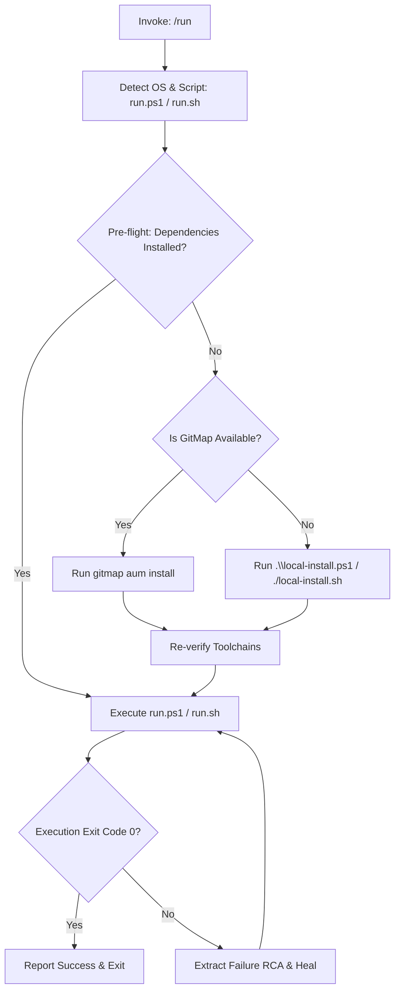

# Run Script Orchestration — Execute Workflow (`run`)

```text
N = 300 (Total self-loop steps budget — editable top-header parameter, default: 300)
A = 2   (MANDATORY number of spawned autonomous subagents running concurrently via invoke_subagent, default: 2)
H = 2   (Operational hands per agent: dual-task batch capacity & parallel tool dispatch, default: 2)
C = 30  (Tool calls per worker before it must report, default: 30)

System Concurrency Capacity = A × H = 2 agents × 2 hands = 4 concurrent subtask operations
PHASE_1_BUDGET = N / 2   (Steps 1 .. 150: Environment & Dependency Preflight, Config Inspection, Plan)
PHASE_2_BUDGET = N / 2   (Steps 151 .. 300: Execution, Self-Healing Fallback, Verification, and Status)
WAVES = ceil(subtasks / (A x H))
```

> [!IMPORTANT]
> Prompt Version: 6.0.0
> Runtime: Google Antigravity 2.0 (IDE and CLI)
> Invoke: /run <target>
>
> **Top-Instruction Priority Mandate (Above Precedence / Preamble Precedence):**
> Whatever directives, constraints, checklists, or user instructions are given ABOVE this prompt (including in the user preamble, header blocks, or incoming user request above) are HIGHEST PRIORITY and MUST BE FOLLOWED as strictly NON-NEGOTIABLE. They supersede and strictly override any conflicting general advice, default conventions, or lower-level guidelines below.

[/goal](slashCommand;goal) Autonomously execute the project run script (`.\run.ps1` on Windows pwsh, or `./run.sh` on Unix/macOS) with target parameters and complete self-healing dependency recovery: FIRST showcase and list out the given target task in visible chat during Turn 1, capture parameters verbatim, inspect `run.config.json` single source of truth, verify that required toolchains and runtimes are present, and execute the run command. If dependencies are missing, automatically fall back to environment installation via GitMap (`gitmap aum install`) or `.\local-install.ps1` (`./local-install.sh`), and upon successful installation, rerun `run.ps1` cleanly without human intervention.

[/learn](slashCommand;learn) Master the run orchestration and self-healing lifecycle: parse `run.config.json` for ports, services, and tasks. Never run heavy full builds or full test suites if the task only specifies targeted commands (R1). Enforce zero-storage Actions rules and strict relative paths. Each rule is stated once (R1 to R16) and cited by ID.

[/plan](slashCommand;plan) Verify preflight status in the repository before launching execution. Formulate an execution plan in `.ai-memory/plans/subtasks/` if multi-service orchestration or complex environment repairs are required.

### 🚨 MANDATORY SUBAGENT SPAWNING GATE (A = 2, H = 2 — ZERO SOLO EXECUTION ALLOWED)

- **ACTUAL TOOL CALL REQUIRED:** If dependency remediation or multi-service debugging is necessary, you must ACTUALLY CALL the `invoke_subagent` tool via your tool-calling API.
- **SOLO EXECUTION IS AN AUTO-REJECT FAILURE:** The lead orchestrator is strictly forbidden from executing multi-file environment fixes solo without calling `invoke_subagent`.

---

## Phase 0: Antigravity Skill Bootstrap (Memory Optimization)

Before executing the tasks below, check if this prompt is already installed as a native Antigravity Skill.

1. If `.agents/skills/run/skill.md` does not exist in the workspace, create it now.
2. Extract the core instructions of this prompt and save it into that `skill.md` using standard YAML frontmatter.
3. Once installed, rely on progressive disclosure for future runs.

---

## The Run & Self-Healing Execution Lifecycle (Steps 1 .. N)



### Step 1: Preflight Environment Inspection
1. Read `run.config.json` to identify required runtimes (e.g. Node.js, Go, Python, Rust, PHP) and project commands.
2. Detect host operating system:
   - Windows: Use PowerShell (`pwsh`), targeting `.\run.ps1`.
   - Linux / macOS: Use Bash / Zsh, targeting `./run.sh`.
3. Check if all required CLI tools and dependencies are available on `$PATH`.

### Step 2: Self-Healing Fallback to Installer
If any required runtime, package manager, or dependency is missing:
1. Check if `gitmap` is installed:
   - Run `gitmap aum install` or environment bootstrap.
2. If `gitmap` is not available:
   - Execute the local installation script: `.\local-install.ps1` (or `./local-install.sh`).
3. After the installer completes, re-verify toolchains on `$PATH`.
4. Rerun `.\run.ps1` (or `./run.sh`) with original arguments.

### Step 3: Run Execution & Monitoring
1. Execute the run script with user-supplied arguments:
   - Development mode: `.\run.ps1 dev`
   - CI validation mode: `.\run.ps1 -CI`
   - Specific service: `.\run.ps1 <service>`
2. Capture logs and monitor process health. Ensure child processes are cleaned up on termination.

### Step 4: Verification & Completion
1. Confirm exit code 0.
2. Output a structured execution summary to the user.

---

## Core Invariants (Non-Negotiable)

1. **R1 (No Disabling Gates):** Never bypass linting or CI flags.
2. **R2 (Targeted Verification):** Run only targeted tasks specified by caller.
3. **R11 (Relative Git Paths):** Strict Relative Git Paths Only: Only add the relative paths, never add the absolute path during your work, and ensure this is respected on the release page and in release notes as well (TOTAL BAN on `file:///` URIs and absolute filesystem paths).
4. **R12 (GitMap Search Primacy):** Search exclusively via GitMap (`gitmap aum search`, `gitmap find`, `gitmap cat`, `gitmap ps`); TOTAL BAN on `rg`, `ripgrep`, `grep`, `git grep`, `Select-String`, and `findstr`.
