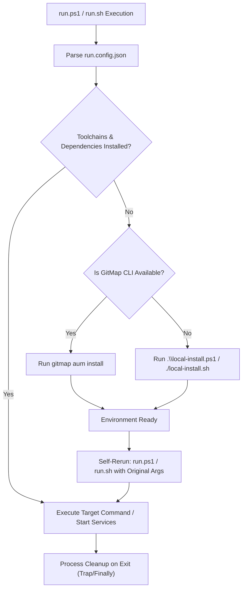

# Create Run & Install Scripts Architecture — CI/CD Workflow (`create-run-ps1-file`)

```text
N = 300 (Total self-loop steps budget — editable top-header parameter, default: 300)
A = 2   (MANDATORY number of spawned autonomous subagents running concurrently via invoke_subagent, default: 2)
H = 2   (Operational hands per agent: dual-task batch capacity & parallel tool dispatch, default: 2)
C = 30  (Tool calls per worker before it must report, default: 30)

System Concurrency Capacity = A × H = 2 agents × 2 hands = 4 concurrent subtask operations
PHASE_1_BUDGET = N / 2   (Steps 1 .. 150: Config Extraction, Script Architecture Design, Plan)
PHASE_2_BUDGET = N / 2   (Steps 151 .. 300: Script Generation, Self-Healing Fallback, Verification)
WAVES = ceil(subtasks / (A x H))
```

> [!IMPORTANT]
> Prompt Version: 6.0.0
> Runtime: Google Antigravity 2.0 (IDE and CLI)
> Invoke: /create-run-ps1-file <task>
>
> **Top-Instruction Priority Mandate (Above Precedence / Preamble Precedence):**
> Whatever directives, constraints, checklists, or user instructions are given ABOVE this prompt (including in the user preamble, header blocks, or incoming user request above) are HIGHEST PRIORITY and MUST BE FOLLOWED as strictly NON-NEGOTIABLE. They supersede and strictly override any conflicting general advice, default conventions, or lower-level guidelines below.

[/goal](slashCommand;goal) Autonomously architect, construct, and verify cross-platform execution runners (`run.ps1` and `run.sh`) driven by a central `run.config.json` manifest, along with accompanying standalone environment installation scripts (`local-install.ps1` and `local-install.sh`): FIRST showcase and list out the given task in visible chat during Turn 1, capture project requirements verbatim, author extensive specifications in `02-spec/21-app/`, decompose into bounded subtasks in `.ai-memory/plans/subtasks/`, implement robust dependency pre-flight checks, integrate intelligent fallback to GitMap (`gitmap aum install`) or `local-install.ps1`/`local-install.sh` with automatic rerun, enforce zero-storage Actions rules, verify with local targeted linters, and commit atomically via `gitmap cpf "<module> - <summary>"`.

[/learn](slashCommand;learn) Master the dynamic runner and install script architecture: decouple orchestration from static commands by centralizing ports, services, and tasks into `run.config.json`. NEVER run heavy full builds or full test suites if the task only specifies runner creation (R1). Enforce zero-storage Actions rules and strict relative paths. Each rule is stated once (R1 to R16) and cited by ID.

[/plan](slashCommand;plan) Write the specification and subtask plans in the repository before touching script code. Map out the service lifecycle, trap/finally process cleanup, dynamic port substitution, and the dual-stage installation fallback loop.

### 🚨 MANDATORY SUBAGENT SPAWNING GATE (A = 2, H = 2 — ZERO SOLO EXECUTION ALLOWED)

- **ACTUAL TOOL CALL REQUIRED:** You must ACTUALLY CALL the `invoke_subagent` tool via your tool-calling API.
- **3-STAGE MANDATORY DISPATCH:**
  1. **Discovery & Architecture Step:** Spawn 2 discovery subagents to inspect repository dependencies, toolchains, and existing configurations.
  2. **Script Generation Step:** Spawn 2 subagents to author `run.config.json`, `run.ps1`, `run.sh`, `local-install.ps1`, and `local-install.sh`.
  3. **Verification Step:** Spawn 2 worker subagents to verify syntax, trap cleanup, and dry-run execution in disjoint boundaries.
- **SOLO EXECUTION IS AN AUTO-REJECT FAILURE:** The lead orchestrator is strictly forbidden from executing script generation solo without calling `invoke_subagent`.

---

## Phase 0: Antigravity Skill Bootstrap (Memory Optimization)

Before executing the tasks below, check if this prompt is already installed as a native Antigravity Skill.

1. If `.agents/skills/create-run-ps1-file/skill.md` does not exist in the workspace, create it now.
2. Extract the core instructions of this prompt and save it into that `skill.md` using standard YAML frontmatter.
3. Once installed, rely on progressive disclosure for future runs.

---

## Core Operational Architecture



### 1. The Configuration Manifest (`run.config.json`)
The JSON file serves as the single source of truth for both local development and CI execution:
```json
{
  "projectName": "Project Name",
  "frontend": {
    "dir": "frontend",
    "port": 3000
  },
  "backend": {
    "dir": "backend",
    "port": 8080
  },
  "host": "127.0.0.1",
  "commands": {
    "install": "npm install",
    "dev:frontend": "npm run dev -- --port {fePort}",
    "dev:backend": "go run ./cmd/server --port {bePort}",
    "build": "npm run build",
    "test": "npm test",
    "lint": "npm run lint"
  }
}
```

### 2. The Dynamic Runner Script (`run.ps1` & `run.sh`)
The script must implement:
1. **Configuration Parsing:** Read `run.config.json` and substitute placeholder tokens (`{fePort}`, `{bePort}`).
2. **Pre-Flight Dependency Verification & Self-Healing Fallback:**
   ```powershell
   function Test-EnvironmentReady {
       # Check required compilers, runtimes, package managers
       return ($true) # Or evaluate actual commands
   }

   if (-not (Test-EnvironmentReady)) {
       Write-Host "Required dependencies missing. Initiating installation fallback..."
       if (Get-Command gitmap -ErrorAction SilentlyContinue) {
           Write-Host "Bootstrapping environment via GitMap..."
           gitmap aum install
       } elseif (Test-Path ".\local-install.ps1") {
           Write-Host "Executing local-install.ps1..."
           & .\local-install.ps1
       } else {
           Write-Error "Neither GitMap nor local-install.ps1 found. Cannot proceed."
           exit 1
       }
       Write-Host "Dependencies installed. Rerunning run.ps1..."
       & .\run.ps1 @args
       exit $LASTEXITCODE
   }
   ```
3. **CI Mode Toggle (`-CI` / `--ci`):**
   - Skip interactive prompts and browsers.
   - Run build, lint, and test sequentially.
   - Exit with code 1 immediately on any failure.
4. **Process Cleanup (Trap / Finally):**
   - Track all spawned child process PIDs.
   - Kill all child processes cleanly on exit, leaving zero orphan processes blocking ports.

### 3. Standalone Installer Scripts (`local-install.ps1` & `local-install.sh`)
- Detects the operating system (`Windows`, `Linux`, `macOS`).
- Detects available package managers (`winget`, `choco`, `brew`, `apt`, `pacman`).
- Installs necessary language runtimes (Node.js, Go, Python, Rust, PHP) and project dependencies.
- Sets up environment variables and `$PATH` entries.

---

## Core Invariants (Non-Negotiable)

1. **R1 (No Disabling CI/CD):** Never skip tests or bypass linters.
2. **R8 (Atomic Commit Standard):** Use hyphen separator `gitmap cpf "<module> - <summary>"`.
3. **R11 (Strict Relative Git Paths):** All scripts reference repository-relative paths only. Only add the relative paths, never add the absolute path during your work, and ensure this is respected on the release page and in release notes as well (TOTAL BAN on `file:///` URIs and absolute filesystem paths).
4. **Strict Lowercase:** All scripts and configurations must use lowercase filenames (`run.ps1`, `run.sh`, `run.config.json`, `local-install.ps1`, `local-install.sh`).
