# White Blue Theme Design System: Master Index & Token Flow

> **/goal** Master, enforce, and verify the architectural standards, 3-format color token hierarchy (`HEX`, `RGB`/`RGBA`, `HSL` + `OKLCH`), fluid typography scale, and hardware-accelerated CSS3 + spring interaction models for the White Blue Theme ("White Theme").
> **/learn** Master the light-first high-trust enterprise editorial aesthetic, alternating section band rhythm (`light` -> `soft` -> `light` -> `dark`), 3D flip mega-menu navigation, `WhiteBlueButton` shine/pointer-fill mechanics, and self-assembling capability stacks so even a blind AI agent can reproduce every screen with 100% fidelity.

**Version:** 1.0.0
**Updated:** 2026-09-30
**Status:** Active
**AI Confidence:** Production-Ready
**Ambiguity:** None

---

## 1. Executive Architecture & Visual Personality

The **White Blue Theme** (`04-white-blue-theme`, also referred to as the **White Theme**) establishes a light-first, high-trust enterprise editorial visual language engineered for B2B cloud platforms, ERP/CRM portals, consulting flagships, and technical product marketing:

- **Light-First Editorial Authority:** Grounded on pure crisp paper (`#FFFFFF` / `rgb(255, 255, 255)` / `hsl(0, 0%, 100%)`) and cool mist-tinted soft bands (`#EEF3FA` / `rgb(238, 243, 250)` / `hsl(215, 55%, 96%)`), reserving deep obsidian slate (`#04070F` / `rgb(4, 7, 15)` / `hsl(224, 58%, 4%)`) strictly for high-contrast spotlight bands.
- **Dual-Chroma Cobalt & Electric Violet Accents:** Anchored by Deep Royal Navy (`--brand-primary`: `#0D2975` / `rgb(13, 41, 117)` / `hsl(224, 80%, 25%)`), Electric Cobalt (`--brand-secondary`: `#2563EB` / `rgb(37, 99, 235)` / `hsl(221, 83%, 53%)`), Electric Violet (`--brand-tertiary`: `#822EE8` / `rgb(130, 46, 232)` / `hsl(267, 80%, 55%)`), and Luminous Cyan (`--brand-highlight`: `#03D5E7` / `rgb(3, 213, 231)` / `hsl(185, 97%, 46%)`).
- **Mandatory 3-Format Color Governance:** Every color token across the entire specification is documented side-by-side in **HEX** (`#RRGGBB`), **RGB / RGBA** (`rgb(r, g, b)` / `rgba(r, g, b, a)`), and **HSL** (`hsl(h, s%, l%)`), alongside its runtime CSS **OKLCH** (`oklch(L C H)`) definition.
- **Three-Font Editorial Stack (Zero `Inter`):** Pairs geometric display authority (`Ubuntu`) with warm human-readable body copy (`Poppins`) and technical precision (`JetBrains Mono`) for eyebrows, tabular metrics, and index pills.
- **No-Jump Premium Surface Choreography:** Light-band cards (`card-premium`) and typographic rows (`row-premium`) never jump upward with crude translateY hacks; instead, a `2px` brand gradient rule grows vertically down the left edge (`scaleY(0 -> 1)`) while the surface warms by `4%–5%` primary tint and tracks the cursor with a `320px` radial spotlight (`spotlight-light`).

---

## 2. 4-Tier Token Flow & Architectural Pipeline

The White Blue Theme enforces a strict 4-tier token propagation pipeline from primitive color ramps to live section composition:

```mermaid
flowchart TD
    subgraph Tier1["Tier 1: Primitive 3-Format + OKLCH Color Ramps"]
        T1_Blue["Blue Ramp (--blue-50 #F0F6FF to --blue-900 #0D2975)"]
        T1_Violet["Violet Ramp (--violet-50 #F7F3FF to --violet-900 #2D0063)"]
        T1_Accent["Cyan / Indigo / Teal (--cyan-400 #03D5E7, --indigo-500 #5856E9, --teal-500 #009F9F)"]
        T1_Neutral["Cool Slate Ink Ramp (--neutral-50 #F8FAFC to --neutral-900 #090E18)"]
    end

    subgraph Tier2["Tier 2: Semantic Brand, Surface & Band Scope Tokens"]
        T2_Brand["--brand-primary (#0D2975) / --brand-secondary (#2563EB) / --brand-tertiary (#822EE8)"]
        T2_Light["Default Light Band: --background (#FFFFFF), --foreground (#090E18), --border (#E2E6ED)"]
        T2_Soft[".band-soft Scope: --background (#EEF3FA), --card (#FFFFFF)"]
        T2_Dark[".band-dark Scope: --background (#04070F), --card (#0C121E), --foreground (#D0D7E5)"]
    end

    subgraph Tier3["Tier 3: Typography, Gradients & Kinetic Utilities"]
        T3_Font["Fonts: Ubuntu (Display) + Poppins (Body) + JetBrains Mono (Eyebrows)"]
        T3_Button["WhiteBlueButton: .shine-sweep (@keyframes wb-shine) & .pointer-fill (scaleY)"]
        T3_Card["Premium Surfaces: .card-premium & .row-premium (2px Left Gradient Rule)"]
        T3_Motion["Motion: SlideSwapLabel, Magnetic, SpotlightCard, TiltCard, MaskedHeading"]
    end

    subgraph Tier4["Tier 4: High-Conversion Section Library"]
        T4_Nav["Sticky 72px Glass Header + Safe-Region Mega-Menu + 3D Flip Promo Card"]
        T4_Hero["Light-First Split Hero + Self-Assembling CapabilityStack (2200ms Cycle)"]
        T4_Work["Pinned Sticky-Note Workflow Board (3D Glossy PushPin + SVG NoteConnector)"]
        T4_Stack["Fluted Ribbed Glass ScrollStack + Tabbed Capabilities + Interactive Pricing"]
    end

    Tier1 --> Tier2
    Tier2 --> Tier3
    Tier3 --> Tier4
```

---

## 3. Alternating Section Band Rhythm

Pages built with the White Blue Theme never stack two identical background tones back-to-back without a structural separator. Sections alternate rhythmically across four band scopes:

| Band Scope | CSS Selector / Prop | Background (`HEX` / `RGB` / `HSL`) | Card Surface (`HEX` / `RGB` / `HSL`) | Primary Text (`HEX` / `RGB` / `HSL`) | Typical Usage |
|:---|:---|:---|:---|:---|:---|
| **Light Band (Default)** | `:root` / `<Section tone="light">` | `#FFFFFF` / `rgb(255, 255, 255)` / `hsl(0, 0%, 100%)` | `#FFFFFF` / `rgb(255, 255, 255)` / `hsl(0, 0%, 100%)` | `#090E18` / `rgb(9, 14, 24)` / `hsl(220, 45%, 6%)` | Split Hero, Flagship Solutions Grid, Sticky-Note Workflow Board, Pricing |
| **Soft Band** | `.band-soft` / `<Section tone="soft">` | `#EEF3FA` / `rgb(238, 243, 250)` / `hsl(215, 55%, 96%)` | `#FFFFFF` / `rgb(255, 255, 255)` / `hsl(0, 0%, 100%)` | `#090E18` / `rgb(9, 14, 24)` / `hsl(220, 45%, 6%)` | Tabbed Capability Board, Trust Marquee, Site Footer, Secondary Feature Grids |
| **Dark Band** | `.band-dark` / `<Section tone="dark">` | `#04070F` / `rgb(4, 7, 15)` / `hsl(224, 58%, 4%)` | `#0C121E` / `rgb(12, 18, 30)` / `hsl(220, 43%, 8%)` | `#D0D7E5` / `rgb(208, 215, 229)` / `hsl(220, 29%, 86%)` | High-Contrast Telemetry Showcase, Executive CTA Banner, Dark Glass Grids |
| **Void Band** | `.band-void` | `#010204` / `rgb(1, 2, 4)` / `hsl(220, 60%, 1%)` | `#020408` / `rgb(2, 4, 8)` / `hsl(220, 60%, 2%)` | `#D0D7E5` / `rgb(208, 215, 229)` / `hsl(220, 29%, 86%)` | Spotlight Testimonial Stage (single illuminated `panel-wash` card in near-black void) |

---

## 4. Specification Directory Map

The White Blue Theme specification suite is organized into four self-contained architectural blueprints:

| # | Specification File | Focus Area | Key Deliverables |
|:---|:---|:---|:---|
| `00` | [`readme.md`](./readme.md) | Master Index & Architecture | Executive overview, 4-tier Mermaid token pipeline, section band rhythm, and blind-AI implementation checklist |
| `01` | [`01-colors-typography-and-tokens.md`](./01-colors-typography-and-tokens.md) | 3-Format Color Palettes, Typography & Tokens | Complete 3-format color tables (`HEX`, `RGB`/`RGBA`, `HSL` + `OKLCH`) for Blue, Violet, Cyan/Indigo/Teal, Neutral Slate, Brand/Surface/Status, Band Scopes, `Ubuntu` + `Poppins` + `JetBrains Mono` font stack, 10 fluid `@utility` type classes, gradients, shadows, radii, neumorphism, and LESS mixins |
| `02` | [`02-header-mega-menu-and-footer.md`](./02-header-mega-menu-and-footer.md) | Header, Mega-Menu, Footer & Floating Chrome | Sticky `72px` glassmorphic header, scroll threshold elevation (`window.scrollY > 12`), per-character `SlideSwapLabel` nav links, `14px` safe-region hover Mega-Menu with **3D Flip Promo Card** (`[perspective:1400px]`, `rotateY(180deg)`), mobile drawer without sticky-breaking body overflow, soft-band footer, `StickyCta`, and `BackToTop` |
| `03` | [`03-buttons-motion-and-interactions.md`](./03-buttons-motion-and-interactions.md) | Buttons, Motion & Micro-Interactions | `WhiteBlueButton` (6 variants, 4 sizes), `.shine-sweep` (`@keyframes wb-shine`), `.pointer-fill` bottom-up fill, `.gradient-text` (`@keyframes wb-text-sweep`), `Magnetic` spring cursor pull, `Reveal` / `StaggerGroup` / `MaskedHeading` scroll reveals, `TiltCard`, `SpotlightCard` (`spotlight` & `spotlight-light`), `ToggleRow` spring switch, and `DragRail` |
| `04` | [`04-cards-heroes-and-section-library.md`](./04-cards-heroes-and-section-library.md) | Cards, Heroes & Section Library | `SurfaceCard`, `GlassCard`, `NeuCard`, `card-premium` & `row-premium` (2px left gradient border growth), Light-First Split Hero with Self-Assembling `CapabilityStack`, Flagship `SolutionsGrid`, Pinned Sticky-Note Workflow Board (`PushPin` + `NoteConnector`), Fluted Ribbed Glass `ScrollStack`, Tabbed Capabilities, Pricing, and Lead Form |

---

## 5. Blind-AI Implementation Checklist

An AI agent implementing or auditing a project with the White Blue Theme MUST verify every item below:

- [ ] **Zero Hardcoded Untokenized Colors:** All components consume CSS custom properties (`var(--primary)`, `var(--card)`, `var(--border)`) while documentation and design handoffs cite all three standard formats (`HEX`, `RGB`/`RGBA`, `HSL`).
- [ ] **Three-Font Contract Loaded:** Google Fonts stylesheet loads `Ubuntu` (`400, 500, 700`), `Poppins` (`400, 500, 600`), and `JetBrains Mono` (`400, 500, 600`); `Inter` is never used.
- [ ] **Alternating Band Rhythm:** Adjacent page sections alternate between default light (`#FFFFFF`), `.band-soft` (`#EEF3FA`), and `.band-dark` (`#04070F`) scopes.
- [ ] **Sticky Header Integrity:** `html` and `body` use `overflow-x: clip` (never `overflow: hidden` on `body` during mobile menu open) so `position: sticky` on the `72px` header and `ScrollStack` cards never breaks.
- [ ] **Positive Boolean State Naming:** All interactive state variables in React/TypeScript use positive boolean identifiers (`isScrolled`, `isOpen`, `isActive`, `isPaused`, `isInView`, `isReducedMotion`) evaluated implicitly without `== true` or negated `!` compound conditions.
- [ ] **Reduced-Motion & Offscreen Brakes:** `@media (prefers-reduced-motion: reduce)` collapses transitions and disables `.shine-sweep::after`, while `[data-anim="paused"]` and `html[data-tab-hidden="true"]` pause infinite keyframe loops offscreen.

---

## 6. Cross-References

| Reference Document | Relative Path |
|:---|:---|
| Design System Master Index | [`../readme.md`](../readme.md) |
| Sweet Digs Design System | [`../03-sweet-digs-design-system/readme.md`](../03-sweet-digs-design-system/readme.md) |
| Consolidated Design System Reference | [`../../17-consolidated-guidelines/10-design-system.md`](../../17-consolidated-guidelines/10-design-system.md) |
| Spec Authoring Guide | [`../../01-spec-authoring-guide/readme.md`](../../01-spec-authoring-guide/readme.md) |
