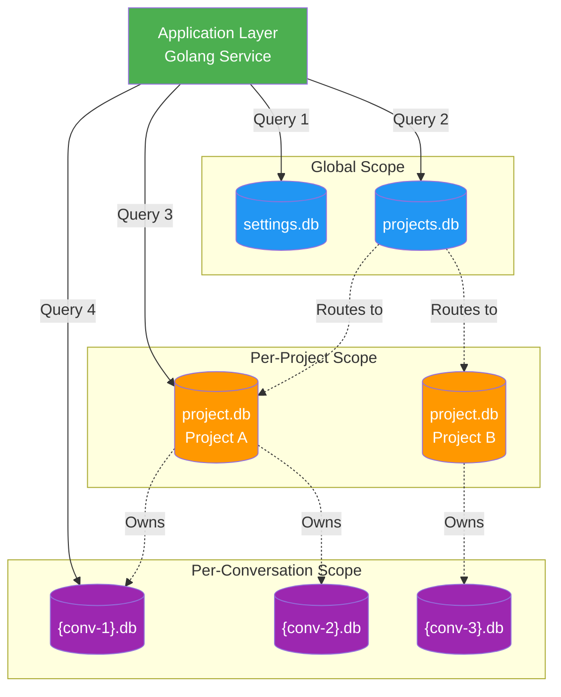

# CONTEXT-FOR-AI.md

**Version:** 1.0.0  
**Updated:** 2026-01-30  
**Purpose:** Quick-reference entry point for AI agents to understand project architecture

---

## 🎯 Start Here

This file provides essential context for AI agents working on this codebase. For comprehensive details, see `.ai-memory/memory/` and the spec folders.

---

## Project Overview

**Spec Builder v3** is a local-first product requirements tool for developers to create and manage PRDs with integrated AI code generation.

| Layer | Technology |
|-------|------------|
| Frontend | React + TypeScript + Tailwind CSS + shadcn/ui |
| Backend | Golang + SQLite (GORM) |
| Architecture | Local-first with hybrid storage |

---

## 🏗️ Critical Architecture Patterns

### 1. Split Database System

**Memory:** System memory `architecture/database/split-database-system`

The application uses a **four-tier SQLite architecture** for data isolation:

| Database | Scope | Example Contents |
|----------|-------|------------------|
| `settings.db` | Global | User preferences, seedable configs, UI state |
| `projects.db` | Global | Project index, routing metadata, last-opened |
| `project.db` | Per-Project | Specs, instructions, artifacts, local settings |
| `{conv-id}.db` | Per-Conversation | Message history, RAG context, tool calls |

**Critical Rule:** Cross-database JOINs are forbidden. Combine data at the application layer.

#### Architecture Diagram



#### Data Flow Rules

| From → To | Allowed? | Method |
|-----------|----------|--------|
| settings.db → projects.db | ❌ No JOIN | App-layer merge |
| projects.db → project.db | ❌ No JOIN | Route, then query |
| project.db → {conv}.db | ❌ No JOIN | App-layer merge |

```go
// ✅ CORRECT - Application-layer aggregation
projects := projectsRepo.List()
for _, p := range projects {
    settings := settingsRepo.GetForProject(p.ID)
    // Combine in memory
}

// ❌ FORBIDDEN - Cross-database JOIN
db.Raw("SELECT * FROM projects.db JOIN settings.db...")
```

---

### 2. Seedable Configuration Pattern

**Memory:** `.ai-memory/memory/features/seedable-configuration.md`

Configuration values are managed through versioned JSON seed files with database persistence.

**Seeding Condition (Golden Rule):**
```
IF NOT EXISTS 
   OR (SeedVersion > StoredVersion AND IsUserModified == FALSE)
THEN seed the value
```

| Flag | Meaning |
|------|---------|
| `IsUserModified = FALSE` | System-managed, will auto-update on version bump |
| `IsUserModified = TRUE` | User changed via UI, protected from auto-seeding |

**Lifecycle:**
1. App starts → reads `/seeds/config/*.json`
2. For each config: check condition above
3. If condition met → write to `settings.db`
4. User changes via UI → sets `IsUserModified = TRUE`
5. Version bump → only updates non-user-modified values

**Reset Pattern:** Set `IsUserModified = FALSE` to allow re-seeding on next startup.

---

## 📁 Key Directories

| Path | Purpose |
|------|---------|
| `.ai-memory/memory/` | AI memory index and feature specs |
| `.ai-memory/memory/architecture/` | System architecture patterns |
| `.ai-memory/memory/features/` | Feature-specific documentation |
| `.ai-memory/memory/suggestions/` | Improvement tracking |
| `.ai-memory/memory/workflow/` | Workflow plans and conventions |
| `02-spec/` | Product specifications |

---

## 🧠 Memory Quick Links

### Architecture
- [Split Database System](.ai-memory/memory/architecture/split-database-system.md) (if applicable to Spec Builder v3)

### Key References
- [Project Context](.ai-memory/memory/02-project-context.md)
- [Workflow Guidelines](.ai-memory/memory/01-workflow.md)
- [Suggestions Tracker](.ai-memory/memory/suggestions/01-suggestions-tracker.md)
- [Reliability Risk Report](.ai-memory/memory/03-reliability-risk-report.md)

---

## 🔧 Coding Standards

1. **TypeScript:** No `any`, no `unknown`, use Enums for categories
2. **Naming:** Numeric-prefixed hyphen-case (`05-features`, `12-prompts`)
3. **Database:** PascalCase for tables and fields
4. **Switches:** Exhaustive patterns with `never` type assertion

---

## 🚀 For AI Training

To train an external AI model on this project:

1. **Minimum:** Feed `CONTEXT-FOR-AI.md` (this file) + `.ai-memory/memory/02-project-context.md`
2. **Complete:** Feed entire `.ai-memory/memory/` folder + `02-spec/` folder
3. **Roadmap:** Feed `plan.md` (repo root) for future work

---

## Cross-Reference

- Memory index: `.ai-memory/memory/01-workflow.md`
- Master spec index: `spec/readme.md`
- Future work roadmap: `plan.md` (repo root)
- Risk report: `.ai-memory/memory/03-reliability-risk-report.md`
